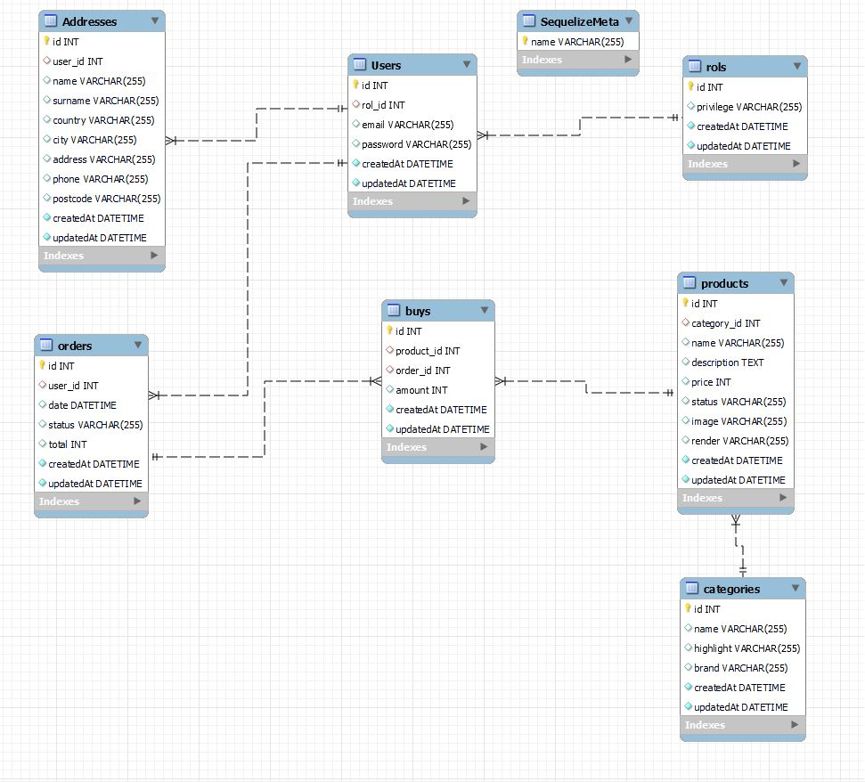

# Welcome to the database of my dental clinic

<details>
  <summary>Content 📝</summary>
  <ol>
    <li><a href="#objetivo">Objective</a></li>
    <li><a href="#sobre-el-proyecto">About the project</a></li>
    <li><a href="#stack">Stack</a></li>
    <li><a href="#diagrama-bd">Diagram</a></li>
    <li><a href="#instalación-en-local">Installation🚀</a></li>
    <li><a href="#endpoints">Endpoints</a></li>
    <li><a href="#futuras-funcionalidades">Future functionalities</a></li>
    <li><a href="#estado">Project status</a></li>
    <li><a href="#contribuciones">Contributions</a></li>
    <li><a href="#licencia">License</a></li>
    <li><a href="#webgrafia">References</a></li>
    <li><a href="#conclusion">Conclusion</a></li>
    <li><a href="#agradecimientos">Acknowledgments</a></li>
    <li><a href="#contacto">Contacto</a></li>

  </ol>
</details>

## Objective
This project required a functional API connected to a database for a business, in this case an ecommerce, with one-to-many and one-to-one relationships, as well as verification tokens for access to certain sections of the ecommerce website depending on the type of user. And functionality for product visualization, shopping cart and product filtering by categories.
## About the project
This Api is the one that later will be consumed in the frontend, for the final project of geekshubs academy, which is based on a complete ecommerce with all the basic functionalities such as product visualization, user registration and login, shopping and more features.

## Stack
Technologies used:
<div align="center">
<a href="https://www.expressjs.com/">
    
</a>
<a href="https://nodejs.org/es/">
    
</a>
<a href="https://developer.mozilla.org/es/docs/Web/JavaScript">
    
</a>
 </div>

## Diagram BD


## Installation in local🚀
1. Clone the repository
2. ` $ npm install express nodemon dotenv sequelize-cli sequelize sequelize bcrypt jsonwebtoken`
3. We connect our repository with the database 
4. ``` $ Run the ``` migrations ```. 
5. ``` $ Execute the seeders ``. 
6. ``` $ npm run dev ``` $ npm run dev ```.

## Endpoints
<details>
<summary>Endpoints</summary>

- AUTH

    - LOGIN

            POST http://localhost:3000/login  
        body:
        ``` js
            {
                "user": "Ramon",
                "email": "ramon@ramon.com",
                "password": "123456"
            }
        ```
- ROL

    - CREATE

            POST http://localhost:3000/rols 
        body:
        ``` js
            {
                "privilege" : "admin"
            }
        ```
    - OTHER

           - GET http://localhost:3000/rols/1

- USER

    - CREATE

            POST http://localhost:3000/users 
        body:
        ``` js
            {
                "password" : "9778dd77234ff",
                "email" : "amanciolado@gmail.com"
            }
        ```
    - OTHER

           - GET http://localhost:3000/users/1
           - PUT http://localhost:3000/users/1
           - DELETE http://localhost:3000/users/1

- aDDRESS

    - CREATE

            POST http://localhost:3000/address
        body:
        ``` js
            {
                "user_id" : "2",
                "name" : "carlos",
                "surname" : "gonzalez",
                "address" : " Av casalduch",
                "phone" : "76575756745"
                "country" : "Spain"
                "city" : "Madrid"
                "postcode" : "12346"
            }
        ```
    - OTHER

           - GET http://localhost:3000/address
           - GET http://localhost:3000/dentists/all
           - PUT http://localhost:3000/address/:id
           - DELETE http://localhost:3000/address/:id

- ORDER

    - CREATE

            POST http://localhost:3000/orders
        body:
        ``` js
            {
                
                "user_id" : "4",
                "total" : "500",
                "status" : "pending",
                "date" : "28/02/2023",
                
            }
        ```
    - OTHER

           - GET http://localhost:3000/orders
           - GET http://localhost:3000/orders/all
           - PUT http://localhost:3000/orders/:id
           - DELETE http://localhost:3000/orders/:id

- SPECIALITY

    - CREATE

            POST http://localhost:3000/specialities
        body:
        ``` js
            {
                "name" : "odontologo",
                "description" : "el mejor dentista",
            }
        ```
    - OTHER

           - GET http://localhost:3000/specialities

- PRODUCT

    - CREATE

            POST http://localhost:3000/products
        body:
        ``` js
            {
                "category_id" : "2",
                "name" : "Iphone 13",
                "price" : "gonzalez",
                "description" : "new product",
                "render" : "url"
                "image" : "url"
                "status" : "New"
            }
        ```
    - OTHER

           - GET http://localhost:3000/products
           - PUT http://localhost:3000/prducts/all
           - PUT http://localhost:3000/products/:id
           - DELETE http://localhost:3000/products/:id

- CATEGORY

    - CREATE

            POST http://localhost:3000/categories
        body:
        ``` js
            {
                "name" : "Phone",
                "highlight": "yes",
                "brand" : "Nike",
                
            }
        ```
    - OTHER

           - GET http://localhost:3000/categories
           

- BUY

    - ALL

           - POST http://localhost:3000/buys
           - GET http://localhost:3000/buys
           - GET http://localhost:3000/buys/cart
           - PUT http://localhost:3000/buys/:productId
           - DELETE http://localhost:3000/buys/info

                      

</details>

## Future functionalities
- Improve the performance in order creation
- Improve shopping cart performance
- Add paginators in the views where products are displayed
- visualization of the products in 3D

## Project status
Project under construction

## Contributions
Suggestions and contributions are always welcome.  

You can do this in two ways:

1. Opening an issue
2. Create a fork of the repository
    - Create a new branch  
        ```
        $ git checkout -b feature/username-improvement
        ```
    - Commit your changes 
        ```
        $ git commit -m 'feat: enhancement X thing'
        ```
    - Push to the branch 
        ```
        $ git push origin feature/user-name-improvement
        ```
    - Open a Pull Request

## License
This project is under MIT License.

## References
To achieve my goal I have gathered information from:

- Sequelize: https://sequelize.org/
- Npm: https://www.npmjs.com/

## Conclusion
Conseguimos plantear y desarrollar el objetivo propuesto de crear una api conectada a su base de datos para un ecommerce de productos tecnologicos utilizando las tecnologías sequelize node, javascipt y msql. Se abordaron los principales aspectos del proyecto. como la posibilidad de registro y login, modificación y borrado de datos de direccion, y visualización de productos, acceso mediante tokens a diferentes rutas etc.

Se pudieron identificar los principales problemas de diseño de la base de datos, las diferentes dificultades que surgieron especialmente con el método de verificación del token y las diferentes relaciones entre las tablas de la base de datos que se consiguieron abordar adecuadamente para que todas las funcionalidades previstas en el diseño básico del proyecto se llevaran a cabo correctamente.

## Acknowledgments

I thank my colleagues for their time dedicated to this project:

- **Adrián**  
<a href="https://www.github.com/solsona1008/" target="_blank"></a>


## Contact

<a href = "mailto:solsona1008@gmail.com"></a>
<a href="https://www.linkedin.com/in/adrian-solsona-miralles-415b27182/" target="_blank"></a> 
</p>

